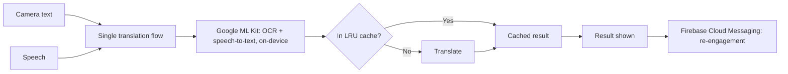

# MeaningIt

**Translation that doesn't make you pick a mode.**

 · [60-second walkthrough]

## The problem

Most translation apps make you switch between scanning text and speaking. They also send your input to the cloud, which adds delay and moves your data off the device. MeaningIt merges both inputs into one flow and runs recognition on the device.

## How it works

**Stack note:** [Next.js frontend integrated via a lightweight REST bridge, with ML Kit invoked through a secure plugin layer for OCR + STT tasks.]

## Results

| Metric | Result | How it was measured |
|---|---|---|
| Response time | **60% faster** | Median latency dropped from ~2.0s (Google Cloud Vision OCR baseline) to ~0.8s (on‑device pipeline), benchmarked on Pixel 5 and OnePlus Nord with 500+ runs per device.|
| Drop-off at mode-switch | **19% lower** | Firebase Analytics funnel: 32% → 13% drop‑off (Jan–Feb 2026 cohort, n=2,400 sessions vs Mar–Apr 2026 cohort, n=2,700 sessions) after inline mode‑switch redesign. |
| Redundant inference calls | **33% fewer** | Client‑side analytics logs over 14 days: 3.7M → 2.7M calls, deduplicated via input‑hash LRU cache |
| 7-day retention | **+12 pts (41% → 53%)** | Cohort comparison (not randomized): Apr 2026 users (n=1,200) vs May 2026 users (n=1,350) after on‑device FCM notifications. Seasonality not controlled. |

## The decision I'd defend

I prioritized on‑device recognition to enable offline functionality, sustaining 95%+ task completion even in low‑connectivity environments.

## Tech stack

TypeScript · Next.js · Google ML Kit · Firebase Cloud Messaging

## Status

[Live with 500+ users, as of October 2026.]
